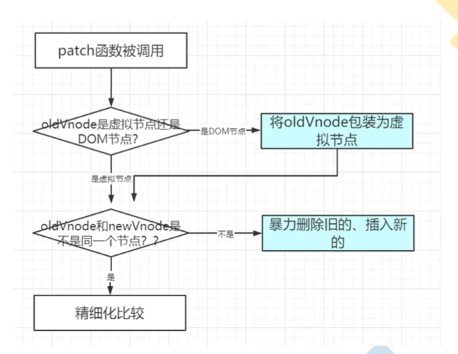

- **h**函数用来产生**虚拟节点**
h('a', { props: { href:'http://www.example.com'}},'示例');

将得到这样的虚拟节点:
{"sel":"a","data": { props: { href: 'http://www.example.com'}},"text":"示例”}

它表示的真正的DOM节点:
<a href="http://www.example.com">示例</a>

- h 函数可以嵌套使用

- 实现h函数
  h('div',{},'text')
  h('div',{},h())
  h('div',{},[])

- diff算法
  1.最小量更新  key很重要
  2.**只有是同一个虚拟节点，才能进行精细化比较**(先比较  选择器 --> 后 key)
  3.**只进行同层比较，不进行跨层比较**
但是2  3 一般不会发生,需求太离谱了
比如2.
<ul v-if="mmm">
<li></li>
<li></li>
<li></li>
</ul>
<ol v-else>
<li></li>
<li></li>
<li></li>
</ol>
<a1v>
3.
<section v-if="mmm">

</section>

调用patch函数

判断oldNode是 虚拟节点 还是 DOM节点

包装成虚拟节点

oldNode 和newNode是不是同一个节点(sel  和 key 相同)

是  精细化比较    不是     暴力删除插入 

创建节点，所有子节点需要递归创建